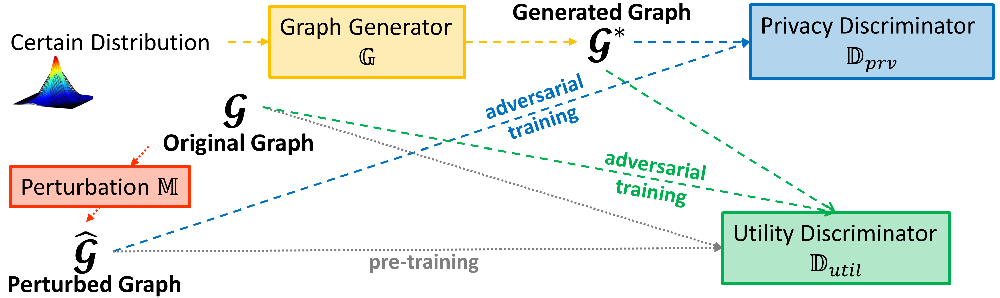

# THePUff

This is the official implementation of paper [Temporal Heterogeneous Graph Generation with Privacy, Utility, and Efficiency](https://openreview.net/pdf?id=tj5xJInWty), accepted by **ICLR'25** as _spotlight_ paper.

## Overview



In this paper, we propose a **T**emporal **He**terogeneous Graph Generator balancing **P**rivacy, **U**tility, and E**ff**iciency, named **THePUff**. More specifically, we first propose a differential privacy algorithm to perturb the input temporal heterogeneous graph for protecting privacy, and then utilize both the perturbed graph and the original one in a generative adversarial setting for THePUff to learn and generate privacy-guaranteed and utility-preserved graph data in an efficient manner.

## Requirements

```
networkx==3.1
numpy==1.24.4
gensim==4.3.0
pytorch==2.0.1
scipy==1.11.2
torch-two-sample==0.1
```

## Train

To train the graph generation framework, run

```
python ThePUff.py --dataset {dataset_name}
```

The generated graph will be stored in ./data/{dataset}/generated/ .

## Test

To evaluate the generated graph, run

```
python metrics.py --dataset {dataset_name}
```

